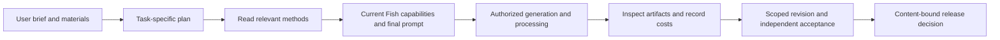

# Fish Skills

Versioned creative workflows for Fish tools, with read-only MCP retrieval of Markdown and references.

**Current preview: `0.1.0-preview.6`, seven English experimental Skills.** Portrait and character image candidate.3 joins the six existing workflows. The immutable GitHub prerelease distributes the same committed Skill payload. This publication does not activate R2 or a production Fish connection, and consistent creative-quality gains remain unproven.

## Explore

| Skill | Purpose | Evidence and limits |
|---|---|---|
| [Product photos](skills/product-photo-series/SKILL.md) | Studio, usage, detail and commercial product images | Purpose, lighting and reference methods; drinkware structure is now part of photo directions. Current English behavior and artifact acceptance remain pending. |
| [Thumbnails / covers](skills/thumbnail-cover/SKILL.md) | Concepts, rendering, text and edits | Content relationships guide concept selection; local edits and split frames remain available. This revision has no new behavior or artifact acceptance. |
| [UGC product video](skills/ugc-product-video/SKILL.md) | Faceless product demonstrations, narration and assembly | Deliver a complete product short. Use native narration when suitable; separate narration and local assembly are optional. Local helper regression does not establish product or audio quality. |
| [Video recreation](skills/reference-recreation/SKILL.md) | Recreate reference-video actions with the original or a replacement character | The single-file candidate has only static review; no new action generation, behavior or output-quality acceptance. |
| [Character sheet](skills/character-sheet/SKILL.md) | One character across requested views, expressions or outfits; reusable design references and selected edits | One own-left/right gain; a later reference edit moved a bow to the wrong ear. Not reliable exact turnaround/3D output. |
| [Narrated multiscene video](skills/narrated-multiscene-video/SKILL.md) | Complete stories or explainers: scene plan, shared identity, starting states/actions, narration and assembly | Latest candidate adds real frame checks and start-frame input selection. Targeted clips show book opening and umbrella closure/storage after corrections; strict gaze order and complete-film acceptance remain pending. |
| [Portrait and character image](skills/portrait-character/SKILL.md) | Create or edit person-led still images while preserving requested identity, expression, styling and continuity | Visual review is capability-gated; a text-only Agent must deliver without inventing inspection. English behavior and artifact acceptance remain pending. |

Standalone speech, voice and API guides are [archived](archive/2026-10-08-retired/README.md) and excluded from the current catalog/payload.

## Structure

`SKILL.md` contains task-specific decisions and workflow. Read `references/` only when the request needs them. [Shared execution](skills/shared/core-skeleton.md) covers spending, recovery and delivery. Duplicate creative planning has been removed; drinkware guidance is merged into photo directions. There are no inherited global visual bans or static model-dialect tables. User choices override creative defaults.



Media generation uses the Fish connection selected in the session. UGC's optional local assembly helper only processes existing footage; it does not call a local generation server.

## Inspect without generating media

Read the linked source files directly. For a committed checkout, build and inspect the versioned package locally:

```bash
git clone https://github.com/yiruoyanyu-ui/fish-skills.git
cd fish-skills
uv sync --locked
uv run --locked fish-skills build
```

This creates local package artifacts. It does not publish a Release, activate R2 or generate paid media. The [colleague quickstart](docs/COLLEAGUE_QUICKSTART.md) describes the reader; its explicit `0.1.0-preview.3` example reads historical published content, not this main-branch update.

## Distribution and maintenance

GitHub stores source. Published GitHub Releases/R2 packages distribute immutable versions. The Skills MCP reads instructions; a separately connected Fish media MCP executes authorized operations. Reading a Skill does not install a script, grant spending authorization or prove media quality.

Edit relevant sources and references, synchronize catalog descriptions, commit and inspect CI. This revision advances the catalog to preview.6. Stable publication still requires genuine content-bound review evidence. Retain all attempts, failures and costs; keep optimization cases separate from independent acceptance. Translation changes content hashes and does not transfer quality approval automatically.

- [Two new workflows: purpose, examples and evidence](docs/CHARACTER_STORY_PREVIEW.md)
- [Current validation and limitations](docs/VALIDATION.md)
- [Sources and translation boundary](docs/SOURCE.md)
- [Source update notes](docs/RELEASE_NOTES.md)
- [MCP connection](docs/AGENT.md)
- [CI and R2 setup](docs/SETUP.md)

Credentials, private user material, temporary asset URLs and evaluation media are excluded from this source update.
