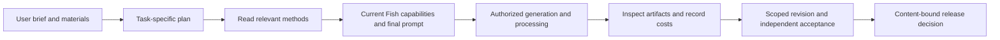

# Fish Skills

Versioned creative workflows for Fish tools, with read-only MCP retrieval of Markdown and references.

**Current main-branch source: `0.1.0-preview.4`, three English experimental Skills.** This is a GitHub source update, not a GitHub Release, R2 channel activation or production Skill deployment. Existing clients using a published version still read that version. These candidates are available for inspection and experimentation, not certified as consistently better than their controls.

## Explore

| Skill | Purpose | Evidence and limits |
|---|---|---|
| [Product photos](skills/product-photo-series/SKILL.md) | Studio, usage, detail and commercial product images | Historical drinkware cases; category-specific fidelity and current English adaptation need further acceptance. |
| [Thumbnails / covers](skills/thumbnail-cover/SKILL.md) | Concepts, rendering, text and edits | Two recent short-brief tasks met tested hard requirements, with no demonstrated advantage over controls. |
| [UGC product video](skills/ugc-product-video/SKILL.md) | Faceless product demonstrations, narration and assembly | Real production runs exist, but fidelity and unsupported-claim failures remain. Experimental, not quality-approved. |

Standalone speech, voice and API guides are [archived](archive/2026-10-08-retired/README.md) and excluded from the current catalog/payload. Reference recreation remains under optimization outside this update. Portrait drafts are also outside this update.

## Structure

`SKILL.md` contains task-specific decisions and workflow. Read `references/` only when the request needs them. [Shared execution](skills/shared/core-skeleton.md) covers spending, recovery and delivery; [creative planning](skills/shared/creative-planning.md) is optional for complex work. There are no inherited global visual bans or static model-dialect tables. User choices override creative defaults.



Media generation uses the Fish connection selected in the session. UGC's optional local assembly helper only processes existing footage; it does not call a local generation server.

## Inspect without generating media

Read the linked source files directly. For a committed checkout, build and inspect the versioned package locally:

```bash
git clone https://github.com/yiruoyanyu-ui/fish-skills.git
cd fish-skills
uv sync --locked
uv run --locked fish-skills build
```

This creates local package artifacts. It does not publish a Release, activate R2 or generate paid media. The [colleague quickstart](docs/COLLEAGUE_QUICKSTART.md) describes the reader; its explicit `0.1.0-preview.3` example reads historical published content, not this main-branch update.

## Distribution and maintenance

GitHub stores source. Published GitHub Releases/R2 packages distribute immutable versions. The Skills MCP reads instructions; a separately connected Fish media MCP executes authorized operations. Reading a Skill does not install a script, grant spending authorization or prove media quality.

Edit relevant sources and references, update the catalog/version, commit and inspect CI. Publication is a separate manual action under Actions → Publish Skills. Stable publication requires genuine content-bound review evidence. Retain all attempts, failures and costs; keep optimization cases separate from independent acceptance. Translation changes content hashes and does not transfer quality approval automatically.

- [Current validation and limitations](docs/VALIDATION.md)
- [Sources and translation boundary](docs/SOURCE.md)
- [Source update notes](docs/RELEASE_NOTES.md)
- [MCP connection](docs/AGENT.md)
- [CI and R2 setup](docs/SETUP.md)

Credentials, private user material, temporary asset URLs and evaluation media are excluded from this source update.
