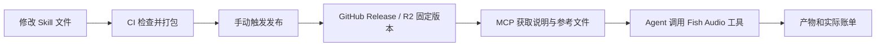

# Fish Skills

为 Fish 媒体任务维护可版本化的 Skill，并通过 MCP 按需获取 Markdown 与参考文件。

**当前首版：发布与获取预览。**导入 12 个 Skill，两个为 dormant；效果仍待独立评测。内容获取与收费媒体生成分开。

## 三件东西各自做什么

| 内容 | 放哪里 | 谁用 |
|---|---|---|
| Skill 主文档、references、示例 | 本仓库 `skills/` | 作者编辑，Agent 阅读 |
| 已发布版本与文件清单 | GitHub Release；配置后也发到 R2 | MCP 服务按版本读取 |
| 媒体执行能力 | 已连接的 Fish Audio MCP | Agent 估价、生成、查询、交付 |



GitHub 是源文件，R2 是版本发放存储，MCP 是读取入口。上传文档不会自动调用生成工具，也不会安装或执行参考脚本。

## 本地开始

需要 Python 3.11+、uv；GitHub 私有版读取还需本机 gh 已登录，或设置只读 `FISH_SKILLS_GITHUB_TOKEN`。

```bash
uv sync --locked
uv run --locked fish-skills build
uv run --locked fish-skills publish dist/fish-skills-0.1.0-preview.2.zip --activate
uv run --locked fish-skills read --skill product-photo-series
```

默认读写本地 `.store/`，这是文件存储模式，不是 R2 上传。打包要求 `skills/`、`release.json` 与评审记录已提交。

## CI 已定义好什么

1. **Validate and package**：每次 main push / PR 自动检查引用、JSON、路径、大小及明显凭证模式，生成 Manifest、ZIP、校验值，保存构建产物。
2. **Publish Skills**：Actions 页面手动 Run workflow。选 `github` 发布预览 Release；选 `r2` 上传所有文件并逐个读回校验，最后切换 channel 指针，同时保留 GitHub Release。
3. **Switch R2 channel**：填已有版本与频道，先验证完整旧包，再切换指针，用于回退。

检查不代表作品质量评测。没有设置自动收费生成或自动改 Skill。发布与回退共用 CI concurrency，不能并发写频道；其他手工写入者也必须遵守单一发布者约定。

设置和按钮步骤见 [CI 与 R2 设置](docs/SETUP.md)。

## MCP 怎么配合 Skill

当前实现独立的只读 stdio MCP 服务，提供三个工具：

| 工具 | 作用 |
|---|---|
| `list_skills(version?)` | 返回用途、状态和版本，供 Agent 选择 |
| `get_skill_instructions(skill_id, version?)` | 返回主 Markdown、实际版本、文件清单和远端读取说明 |
| `get_skill_file(version, path)` | 读取同版本参考文件，校验 hash；不接受任意路径 |

例如先获取 `product-photo-series`，拿到 `entry_path=skills/product-photo-series/SKILL.md` 与版本，再把 `../shared/core-skeleton.md` 解析成 `skills/shared/core-skeleton.md`，用该版本取回。`fish-media:<name>` 的路由通过另一次 `get_skill_instructions` 读取对应 Skill。

Agent 读完后在 **Fish Audio MCP** 实时查模型、价格并执行。整轮支出按用户授权约束，不能因为读取了 Skill 就自行扩大预算。

连接示例见 [Agent 安装与 Fish 平台集成](docs/AGENT.md)。这版不会自动改本机客户端配置或把工具注册到 `api.fish.audio/mcp`；后者属于 platform-api 集成与部署。

## 更新一个 Skill

1. 修改 `skills/<id>/SKILL.md` 和需要的参考文件；共享约束改 `skills/shared/`。
2. 新增 Skill 时同步填写 `release.json` 中的 ID、entry、description、status。
3. 更新 `release.json` 的版本号；提交并 push，看 CI 的打包结果。
4. 去 Actions → Publish Skills → Run workflow；未配置 R2 时先选 github。
5. Agent 新任务默认取频道当前版；进行中任务持续传已取得的固定版本。

默认版本指针缓存 60 秒；固定版本文件在服务进程内缓存。R2 回退只改频道，新会话/缓存过期后读取旧版。GitHub 临时模式用最新发布的同频道 Release，**不提供 R2 式指针回退**；紧急时显式指定旧内容版本，或配置 R2。

已发布版本不可覆盖。发布中断可在同一 commit 重跑；变更 commit 或文件后发布需新版本。稳定版要求 `reviews/<version>.json` 中有对应 content_digest、reviewer、evidence 和 approved 状态；人工填写该记录不等于平台自动证明质量，仍需实际评测证据。

## 文档

- [CI 与 R2 设置](docs/SETUP.md)
- [Agent 安装与 Fish 平台集成](docs/AGENT.md)
- [导入来源与已知边界](docs/SOURCE.md)

仓库中的 `requirements.lock.txt` 与 `uv.lock` 固定首版运行依赖。发布不包含 `.mcp.json` 本机路径、旧 zip、eval 结果或用户媒体素材。
