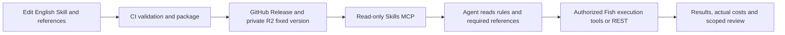

# Fish Skills

Versioned Fish Audio API and media workflows, with read-only MCP retrieval of Markdown and reference files.

**Current preview: 0.1.0-preview.3 — eight English Skills.** The catalog retains five API guides and three media recipes with reported or case-level execution evidence. It does not claim all workflows are quality-approved. See the [validation inventory](docs/VALIDATION.md) before trying a Skill.

## Explore

| Skill | Purpose | Evidence scope |
|---|---|---|
| [API setup](skills/fish-api-setup/SKILL.md) | Key and API wallet checks | Historical real-key notes; original regression log not recovered |
| [TTS](skills/fish-api-tts/SKILL.md) | Speech, dialogue, reference cloning and alignment | Historical eleven-case regression claim; English revision not execution-tested |
| [ASR](skills/fish-api-asr/SKILL.md) | Transcription, timestamps and speaker turns | Historical short clips and a 95-second recording |
| [Voices](skills/fish-api-voices/SKILL.md) | Voice discovery and authorized lifecycle | Historical create/read/delete case |
| [Voice design](skills/fish-api-voice-design/SKILL.md) | Audition candidates and persistence | Historical design and lifecycle observations |
| [Product photos](skills/product-photo-series/SKILL.md) | Drinkware studio/tabletop/detail series | Thermos case tested; weak scene differentiation remains |
| [Thumbnails](skills/thumbnail-cover/SKILL.md) | Concepts, cover rendering and edits | Limited real comparisons; identity/factual review incomplete |
| [UGC product video](skills/ugc-product-video/SKILL.md) | Faceless product video and voice-over | One reported 10-second Fish case, not all HF UGC formats |

Narration, the media router, explainer video and subtitle burning have been removed from the current source/payload/catalog pending further evaluation. Previous immutable releases and Git history remain available; removal is not retroactive revocation. Portrait experiments in another local worktree are not part of this release.

## Try without generating media

Requires Git, Python 3.11+ and uv. Public GitHub Release reads need no R2 keys:

```bash
git clone https://github.com/yiruoyanyu-ui/fish-skills.git
cd fish-skills
uv sync --locked
FISH_SKILLS_BACKEND=github \
FISH_SKILLS_GITHUB_REPOSITORY=yiruoyanyu-ui/fish-skills \
uv run --locked fish-skills read --version 0.1.0-preview.3 --skill product-photo-series
```

[Colleague quickstart](docs/COLLEAGUE_QUICKSTART.md) explains MCP connection. Reading documents does not authorize or submit generation. Media execution requires a separately authorized Fish Audio MCP; REST examples require the user's API key and API wallet.

## Storage and execution



GitHub is the source; R2 is version distribution; the MCP reader is the document entry point. The Agent orchestrates atomic operations. Retrieval does not install scripts, launch a backend Agent or prove generated-media quality.

## Maintain

Modify `skills/<id>/SKILL.md` and references, update `release.json`, increment the version, commit and inspect CI. Publish preview using Actions → Publish Skills. Publish stable only with real review evidence bound to the payload digest. Do not invent approval to pass CI.

The current publisher validates paths, JSON, references, sizes and common secret patterns, then uploads/read-checks fixed R2 content before activating the channel. Running tasks pin their original version; new tasks follow the channel after a 60-second pointer cache refresh. Published content is immutable.

- [Validation and restrictions](docs/VALIDATION.md)
- [MCP connection](docs/AGENT.md)
- [CI and R2 setup](docs/SETUP.md)
- [Sources and translation boundary](docs/SOURCE.md)
- [Historical HF workflow adaptation map](docs/HF_WORKFLOW_MAP.md)
- [Release notes](docs/RELEASE_NOTES.md)

The repository is public. Publishing credentials and personal test material are not included. API examples contain multilingual test utterances; guide prose and catalog descriptions are English. The English revision has been structurally checked, not newly evaluated by a paid generation run.
